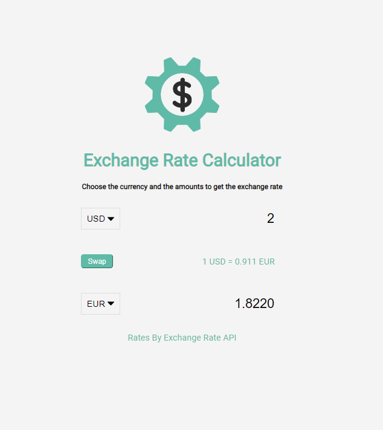

### Exchange Rate Calculator

A useful application where you want to convert between two specific currencies.

Tools: HTML, CSS, JavaScript

### Description

Select countries to get the exchange rate for a specific amount.

Choose your base currency code and the target currency you'd like to get the exchange rate for.

### Features
- Fetch exchange rates from API (https://api.exchangerate-api.com)
- Display the values for both countries
- Update values on amount change dynamivally
- Swap country rates

